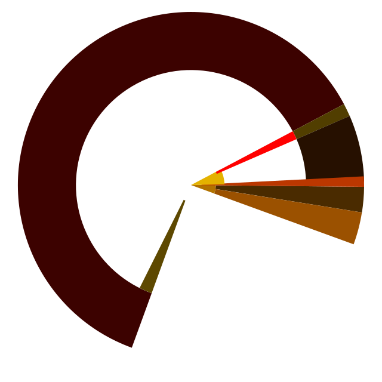

<div align="center">
  
</div>

# ferros - Killswitch Ready Mobile Operating System

## Overview

ferros is a mobile operating system distilled down to what an OS is, written in Rust, designed with zero-downtime power loss tolerance and architectural elimination of entire vulnerability classes. Based on the Redox OS microkernel, ferros extends it with ring memory architecture, hardware key storage, and true killswitch readiness.

**Not Android with modifications. Not Linux for mobile. The inherited assumptions removed until only the operating system is left.**

## Key Innovations

### 🔄 Ring Memory Architecture
- **No boundaries** - Addresses wrap using two's complement, no 0 or MAX
- **2-instruction bounds check** - `(ptr - offset) < limit` in CPU registers
- **No TLB required** - 5-10x faster than page table systems (ai fluff but Claude seems confident!)
- **Continuous rotation** - Process offsets rotate, making ROP attacks impossible
- **Arbitrary allocation sizes** - No rounding to 4KB pages, no internal fragmentation
- **-1 is valid** - No magic values, eliminates NULL dereference class

### 🔌 Killswitch Ready Architecture
- **0ms shutdown latency** - Hardware power cutoff, no software in the loop
- **Ring always valid** - Any ring state is valid, no partial states to save
- **Instant recovery** - No fsck, no recovery mode, boot time unaffected by power loss
- **Atomic-only operations** - Every filesystem operation completes or never existed
- **No cleanup code** - Destructors, finalizers, and shutdown procedures eliminated

### 🛡️ Hardware Key Storage
- **Keys in CPU registers** - Custom RISC-V CSRs or ARM TrustZone, never RAM
- **Read-disabled** - Hardware enforced: can write keys, can't read them back
- **Crypto coprocessor** - ChaCha20 in dedicated silicon, 64 GB/s thruput
- **Killswitch zeroes keys** - Hardware operation, instant and complete
- **DMA-proof** - Debug registers and CSRs aren't on memory bus

### 🔐 TOKEN Integration (Passless Authentication)
- **Device fingerprints** - Hardware-derived identity (Android_ID + IMEI + characteristics)
- **Social attestation** - Friends vouch for device→human mapping
- **A=1** - Authenticate once per device lifetime, never again
- **Multi-device native** - Each device independently attested
- **Social recovery** - Threshold of friends reconstitute identity on total loss
- **NFID optional** - Near Field Identity for paranoia-appropriate security

### 🎨 VSF Compositor
- **AGB spectral colour** - Primaries at 703nm/523nm/462nm from geometric mean cone ratios (L/(L+M), M/(L+S), S/(S+M))
- **Versatile Storage Format** - The format is defined; the compositor architecture is an open design space
- **No HTML/CSS/JS** - VSF replaces the web rendering stack; how it does so is being worked out

### 💾 Ring Filesystem
- **Random superblock** - Location stored encrypted in UEFI, not at block 0
- **Header ring buffer** - 1000+ valid states at all times, not 1-2 backup superblocks
- **Stochastic placement** - Random block allocation for wear leveling and exploit prevention
- **Dual SSD redundancy** - Different manufacturers at different ring offsets
- **Power-loss tolerant** - Scan header ring, find highest generation, continue

### 🔧 Crypto Coprocessor
- **ChaCha20 in silicon** - Dedicated hardware unit, not CPU instructions
- **Faster than RAM** - 64 GB/s vs ~10-15 GB/s effective RAM bandwidth
- **DMA integrated** - Sits on memory bus, encrypts during transfer
- **Zero CPU cost** - Parallel execution while CPU does other work
- **All storage encrypted** - Default, not optional, no performance penalty

## Bug Class Elimination

Thru architectural decisions, ferros eliminates entire CWE categories:

- **CWE-119** (Buffer Overflow) - No boundaries to overflow
- **CWE-125** (Out-of-bounds Read) - Caught by ring bounds check
- **CWE-190** (Integer Overflow) - Expected behavior in two's complement
- **CWE-416** (Use-After-Free) - Can't read other process memory
- **CWE-476** (NULL Dereference) - NULL is just another address
- **CWE-787** (Out-of-bounds Write) - Hardware check prevents it
- **CWE-823** (Out-of-range Pointer) - Range is circular

Half of MITRE's vulnerability database becomes **irrelevant**, not mitigated.

## Technical Architecture

### Memory Management
- **Ring topology** - No linear address space, wraparound using two's complement
- **Per-process offsets** - Cryptographically random, continuously rotating
- **Hierarchical allocation** - User → App → Component, each with offset+limit
- **No page tables** - Direct physical addressing with ring offsets
- **No TLB** - No cache pollution, predictable latency, 50% faster context switch

### Filesystem Layer
- **Based on RedoxFS** - B-tree structure, Copy-on-Write, checksums
- **Ring modifications** - ~2K LOC changed, block allocator and superblock logic
- **Atomic updates** - Generation numbers, never partial writes
- **No journal needed** - Header ring provides hundreds of consistent states
- **Vendor diversity** - Multiple SSDs from different manufacturers

### Driver Model
- **Microkernel isolation** - Drivers in userspace, can't crash kernel
- **No cleanup required** - Failed drivers simply restart
- **Hot-swap support** - Load/unload without system impact
- **No binary blobs** - Pure Rust, no closed-source components

### Cryptographic Stack
- **Keys in hardware** - Never in RAM, even encrypted
- **ChaCha20 everywhere** - Storage, memory, network, IPC
- **Poly1305 authentication** - All encrypted data is authenticated
- **Forward secrecy** - Rolling keys, stolen device can't decrypt future messages
- **Social revocation** - Threshold attestation to revoke compromised devices

## Hardware Platform: Glyph

ferros targets ARM devices today and custom silicon tomorrow. x86 is explicitly out of scope — Intel ME and AMD PSP are architectural backdoors, not bugs. RISC-V is the long-term target for fully auditable hardware.

### Development Targets
- **Pixel 8 (Tensor G3)** - Primary dev target. ARMv9, `fastboot oem pkvm disable` gives EL2 ownership, full hardware access without fighting TrustZone
- **Apple M1 / Asahi** - Secondary dev target. m1n1 proxy gives live hardware exploration at EL2 without reflashing
- **Any ARM device** - HAL trait abstraction means drivers are portable across supported hardware

### Glyph (Production Target)
- **RISC-V Silicon** - Custom ISA extensions for key storage, no Intel ME / AMD PSP
- **Custom CSRs** - Key storage, read-disabled, hardware enforced
- **Crypto coprocessor** - ChaCha20/Poly1305 in dedicated silicon
- **Killswitch circuit** - Hardware power cutoff, zeroes CSRs simultaneously

### Connectivity
- **Physical SIM slot** - No carrier lock-in, user choice
- **Software eSIM** - GSMA SGP.22 client in ferros, stores credentials in CSRs
- **Data-only** - No phone numbers, no SMS, no legacy telephony
- **Bring Your Own SIM** - Use any carrier globally

### No Compromises
- **Crypto only** - Purchase with BTC/SOL/XMR/TOKEN, no credit cards
- **No phone numbers** - Photon messenger via TOKEN identity
- **Sovereign web only** - Available via fgtw.org/portal, not traditional e-commerce
- **Open source OS** - MIT license, but hardware initially closed for IP protection

## Project Status

**Current Phase:** ARM bring-up — Pixel 8 (Tensor G3) primary target

### Established on ARM (QCM6490 / Qualcomm)
- Bare-metal aarch64 kernel boots (PE/COFF via ABL)
- Framebuffer console (8x16 VGA font, 2x scaling, 1224x2700 AMOLED)
- GENI UART TX
- Pstore/ramoops log pipeline (warm reboot preserves DRAM)
- SPMI PMIC access (flash LED, observer channel reads)
- DPU register reads (splash framebuffer)
- USB device enumeration (DWC3, VID G#1209 PID G#4665)
- Bidirectional Photon Transport over USB (blast mode, per-chunk BLAKE3)
- Hot-reload over USB (72KB kernel binary in <1s, no fastboot needed)
- SD card read/write (4-bit bus, 400KHz, multi-block)
- GCC clock controller, RPMh TCS power enable via cmd-db
- DTB parsing for reserved-memory, bootargs, ramoops address

### In Progress (Pixel 8 / Tensor G3)
- Comms bring-up: PT transport + ferros-bridge over USB
- HAL trait split: `ferros_hal` traits, `ferros_hal_pixel8` implementation
- Ledger: append-only VSF event ring (spec complete, implementation started)
- USB driver: TRB ring for throughput, proper endpoint state machine

### Planned (Next 6 Months)
- 📋 VSF compositor alpha
- 📋 Photon messenger beta
- 📋 Crypto coprocessor design (RISC-V extension or mesh)
- 📋 Silicon layout (Chisel → RTL → GDS)

### Planned (Next 12 Months)
- 📋 Tapeout (RISC-V or mesh + crypto coprocessor)
- 📋 Founders Edition manufacturing (1,000 units)
- 📋 fgtw.org/portal opens for purchases
- 📋 Production beta (Elite Edition, 10,000 units)

## Development Roadmap

### Phase 1: Proof of Concept (Months 1-3)
- Ring memory working on FPGA
- Basic filesystem with power-loss tolerance
- TOKEN identity creation and attestation
- Single-device prototype (Pixel 8 / Tensor G3)

### Phase 2: Alpha System (Months 4-6)
- Multi-process ring memory with rotation
- VSF compositor rendering basic UI
- Photon messenger peer-to-peer communication
- Hardware prototype with killswitch

### Phase 3: Beta Hardware (Months 7-12)
- Silicon tapeout (ASIC or shuttle run)
- Crypto coprocessor functional
- Full TOKEN ecosystem (social attestation, recovery)
- Founders Edition manufactured

### Phase 4: Production (Months 13-24)
- Elite Edition (10K units)
- Pro Edition (100K units)
- App ecosystem emerging
- Developer documentation complete

## Building ferros

**Requirements:**
- Rust nightly (for inline assembly, no_std kernel)
- aarch64-unknown-none target (`rustup target add aarch64-unknown-none`)
- Android fastboot (for initial flash to ARM device)
- nusb (Rust USB library, pulled by cargo)

**Build kernel:**
```bash
cargo build -p ferros_kernel --target aarch64-unknown-none --release
```

**Create boot image:**
```bash
cargo run -p ferros-mkimg -- boot target/aarch64-unknown-none/release/ferros_kernel -o ferros.img
```

**Flash to device (Pixel 8 example):**
```bash
fastboot flash boot_a ferros.img
fastboot set_active a
fastboot reboot
```

**Hot-reload (no reboot needed):**
```bash
cargo run -p ferros-bridge -- reload target/aarch64-unknown-none/release/ferros_kernel
```

**Pull boot log:**
```bash
cargo run -p ferros-bridge -- diag
```

## Contributing

Contributions welcome! Please note:

### Code Standards
- **All code MUST maintain killswitch readyness**
- **No cleanup code in critical paths** - Ring must always be valid
- **Atomic operations only**
- **Rust strongly preferred** - `unsafe` only in audited hardware boundaries

### Areas Needing Help
- **Ring memory kernel** - Core implementation in Rust
- **Filesystem conversion** - RedoxFS → ring topology
- **VSF renderer** - Compositor and widget toolkit
- **Photon messenger** - Peer-to-peer protocol implementation
- **Hardware design** - RISC-V extensions, mesh integration, crypto coprocessor
- **Documentation** - Architecture docs, API references, tutorials

### Testing
- **Power loss testing** - Verify filesystem survives arbitrary power cutoff
- **Rotation testing** - Ensure process offsets rotate without breaking apps
- **Bounds checking** - Verify wraparound catches all out-of-bounds access
- **Performance testing** - Measure vs Linux/Android on real workloads

## Prior Art Establishment

This publication establishes prior art for:

1. **Ring memory architecture** - Two's complement wraparound for security
2. **Continuous offset rotation** - Moving process memory for ROP prevention  
3. **Killswitch ready OS** - Zero-cleanup instant shutdown
4. **Hardware key storage integration** - CSRs/TrustZone for encryption keys
5. **Ring filesystem** - Circular topology with stochastic allocation
6. **Passless authentication via device fingerprints** - TOKEN protocol
7. **Spectral colour in OS compositor** - VSF rendering with biological wavelengths

**First Published:** January 1, 2025  
**Author:** Nick Spiker  
**Project:** ferros

## Licenses

**ferros modifications:** MIT License  
**Original Redox OS code:** MIT License (see LICENSES/MIT.txt)  
**Documentation:** CC-BY-4.0

**Patent stance:** Defensive only. If you attack ferros with patents, our prior art and open-source license is your defense. If you use ferros to attack others with patents, you lose your license.

## Acknowledgments

ferros is based on the excellent [Redox OS](https://gitlab.redox-os.org/redox-os/redox) project. I extend my thanks to the Redox team for their pioneering work in Rust-based operating systems.

Additional inspiration from:
- **Mill Computing** - Metadata tracking and belt architecture concepts efficient.computer
- **Capability systems** (seL4, CHERI) - Tho I chose rings over capabilities
- **Plan 9** - Everything-is-a-file philosophy
- **QNX** - Microkernel done right

## Contact

**Website:** https://holdmyoscilloscope.com/
**Author:** Nick Spiker
**Email:** fractaldecoder@proton.me
